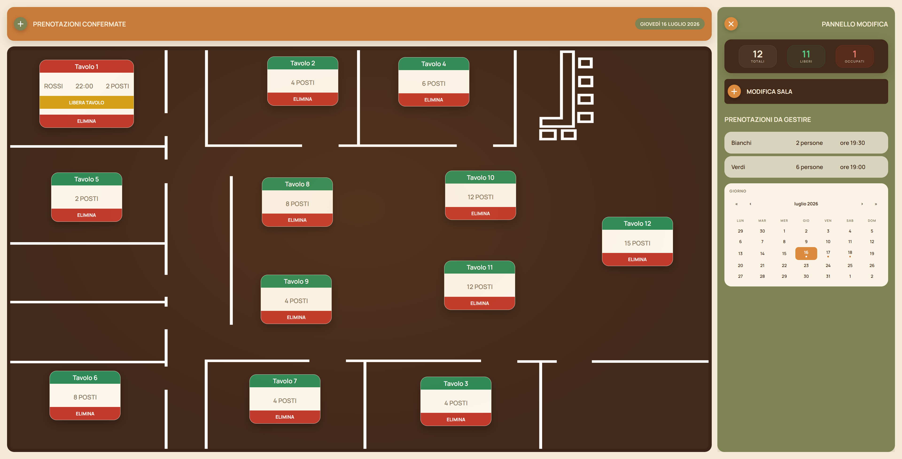

# 🍽️ Gestione Tavoli Ristorante

Applicazione web **full-stack** per la gestione dei tavoli e delle prenotazioni di un ristorante.
Offre una **piantina interattiva della sala** su cui disporre liberamente i tavoli (drag & drop),
gestirne lo stato, assegnare le prenotazioni ai tavoli liberi e inviare al cliente una
**conferma via WhatsApp**.

---

## 🔗 Demo live

<a href="https://gestionale-tavoli-ristorante.vercel.app/">


> ⏳ **Nota:** il backend è ospitato sul piano gratuito di Render, che va "in letargo" dopo circa 15 minuti di inattività.
> La **prima apertura** può quindi richiedere 30-60 secondi per risvegliare il server: dopo, l'app torna reattiva.

---

## 📸 Screenshot



---

## ✨ Funzionalità

- **CRUD completo di tavoli e prenotazioni** — creazione, visualizzazione, modifica ed eliminazione, con i dati persistiti su MongoDB.
- **Piantina dinamica della sala** — sfondi (piantine SVG disegnate in Figma) selezionabili da un menu, con i tavoli **trascinabili liberamente** e la posizione **salvata nel database**.
- **Tavoli per sala** — ogni piantina ha i propri tavoli, con numerazione indipendente (indice composto `numero + sala`): si può avere "Tavolo 1" in ogni sala.
- **Stati con codice colore** — 🟢 libero, 🔴 occupato, 🟡 riservato.
- **Gestione prenotazioni** — pannello delle prenotazioni "da gestire"; con un click si **assegna** una prenotazione a un tavolo libero (che diventa occupato e mostra **nome + ora** del cliente).
- **Pannello prenotazioni confermate** — mostra le prenotazioni assegnate con il relativo tavolo; cliccandone una, il tavolo **si illumina** sulla piantina.
- **Conferma via WhatsApp** — invio al cliente di un messaggio precompilato (link `wa.me`), con feedback "messaggio inviato".
- **Libera tavolo** — un pulsante libera un tavolo occupato e rimuove la relativa prenotazione.
- **Interfaccia curata** — pannelli laterali collassabili, sezioni con titoli descrittivi, statistiche della sala aggiornate in tempo reale.
- **Layout responsive** — coordinate dei tavoli in percentuale; layout adattato a desktop, tablet e mobile (media query anche per orientamento: la piantina resta visibile su telefono in orizzontale).

---

## 🛠️ Tecnologie, librerie e strumenti

### Frontend (`client/`)

| Strumento | Versione | A cosa serve |
|---|---|---|
| **React** | 19 | Libreria per costruire l'interfaccia a componenti, con stato reattivo (hook `useState`, `useEffect`, `useRef`). |
| **TypeScript** | 6 | Superset tipizzato di JavaScript: aggiunge i tipi statici per catturare errori in fase di scrittura. |
| **Vite** | 8 | Build tool e dev server ultra-rapido, con Hot Module Replacement. Compila TS/SCSS e produce il bundle di produzione. |
| **Sass (SCSS)** | 1.x | Preprocessore CSS: variabili, nesting e `&` per stili più puliti e manutenibili. |
| **FontAwesome** | 7 | Libreria di icone (`@fortawesome/react-fontawesome` + `free-solid-svg-icons`) usata per le icone dell'interfaccia. |
| **ESLint** | 10 | Linter per mantenere il codice coerente e segnalare errori/anti-pattern (con `typescript-eslint` e i plugin per React). |
| **Pointer Events API** | nativo | Trascinamento dei tavoli implementato a mano con `onPointerDown/Move/Up` + `setPointerCapture` (nessuna libreria esterna). |

### Backend (`server/`)

| Strumento | Versione | A cosa serve |
|---|---|---|
| **Node.js** | — | Ambiente di esecuzione JavaScript lato server. |
| **Express** | 5 | Framework web per definire le API REST e i middleware. |
| **TypeScript** | 6 | Tipizzazione anche lato server (modelli, rotte, controller). |
| **Mongoose** | 9 | ODM (Object Data Modeling) per MongoDB: definisce schemi, modelli, validazioni e query in modo tipizzato. |
| **tsx** | 4 | Esegue i file TypeScript direttamente in sviluppo (`tsx watch`), con riavvio automatico ad ogni modifica. |
| **cors** | 2 | Middleware per abilitare le richieste cross-origin dal frontend. |
| **dotenv** | 17 | Carica le variabili d'ambiente dal file `.env` (es. la stringa di connessione al database). |

### Database

| Strumento | A cosa serve |
|---|---|
| **MongoDB** (Atlas) | Database NoSQL orientato ai documenti, ospitato in cloud su MongoDB Atlas. Conserva **tavoli** (con posizione e sala di appartenenza) e **prenotazioni**. |

### Strumenti di sviluppo

| Strumento | A cosa serve |
|---|---|
| **Git & GitHub** | Controllo di versione e hosting del codice. |
| **Figma** | Progettazione delle piantine della sala, esportate come **SVG** vettoriali. |
| **WhatsApp (link wa.me)** | Invio dei messaggi di conferma precompilati al cliente. |

---

## 📁 Struttura del progetto

```
App_Gestione_Tavoli_Ristorante/
├── client/                 # Frontend – React + TypeScript (Vite)
│   ├── public/
│   │   └── piantine-sale/  # Piantine SVG della sala
│   └── src/
│       ├── App.tsx         # Componente principale + logica
│       └── App.scss        # Stili (SCSS)
│
└── server/                 # Backend – Express + TypeScript
    └── src/
        ├── index.ts        # Avvio server + connessione MongoDB
        ├── models/
        │   ├── Tavolo.ts        # Schema/Model Mongoose del tavolo
        │   └── Prenotazione.ts  # Schema/Model Mongoose della prenotazione
        └── routes/
            ├── tavoli.ts        # Rotte REST CRUD dei tavoli
            └── prenotazioni.ts  # Rotte REST CRUD delle prenotazioni
```

---

## 🚀 Come avviarlo in locale

### Prerequisiti
- [Node.js](https://nodejs.org/) (v18+)
- Un database MongoDB (es. un cluster gratuito su [MongoDB Atlas](https://www.mongodb.com/atlas))

### 1. Clona il repository
```bash
git clone https://github.com/GazzoSamuele/Gestionale_Tavoli_Ristorante.git
cd Gestionale_Tavoli_Ristorante
```

### 2. Backend
```bash
cd server
npm install
```
Crea un file **`server/.env`** con la tua stringa di connessione MongoDB:
```
MONGODB_URI=mongodb+srv://<utente>:<password>@<cluster>.mongodb.net/gestionale_tavoli
```
Avvia il server:
```bash
npm run dev
```
> Il backend parte su `http://localhost:3001`.

### 3. Frontend
In un secondo terminale:
```bash
cd client
npm install
npm run dev
```
> Il frontend parte su `http://localhost:5173`.

---

## 🔌 API REST (backend)

| Metodo | Rotta | Descrizione |
|---|---|---|
| `GET` | `/api/tavoli` | Elenca tutti i tavoli |
| `POST` | `/api/tavoli` | Crea un nuovo tavolo |
| `PUT` | `/api/tavoli/:id` | Modifica un tavolo (stato, posizione…) |
| `DELETE` | `/api/tavoli/:id` | Elimina un tavolo |
| `GET` | `/api/prenotazioni` | Elenca tutte le prenotazioni |
| `POST` | `/api/prenotazioni` | Crea una nuova prenotazione |
| `PUT` | `/api/prenotazioni/:id` | Modifica una prenotazione (stato, note…) |
| `DELETE` | `/api/prenotazioni/:id` | Elimina una prenotazione |

---

## 🔭 Sviluppi futuri

- Form per creare nuove prenotazioni direttamente dall'interfaccia
- Deploy online (frontend su Vercel, backend su Render)
- Autenticazione con credenziali e ruoli (**admin** vs **client** in sola lettura)
- Aggiornamento dei tavoli in tempo reale (Socket.io)

---

